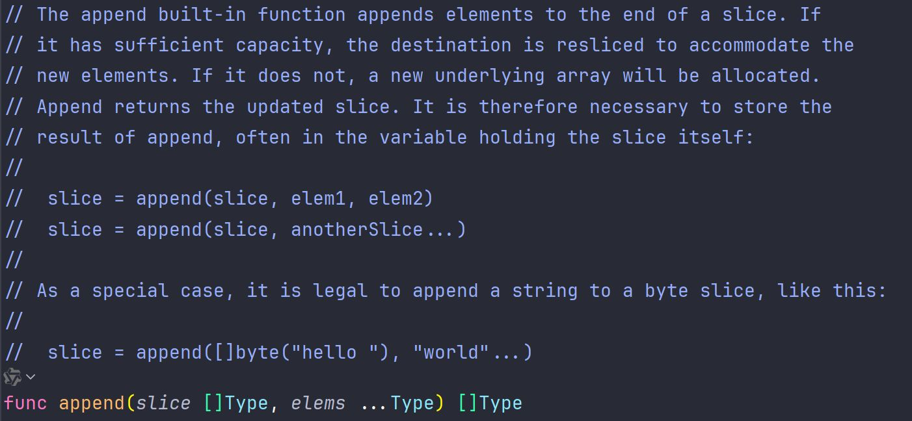
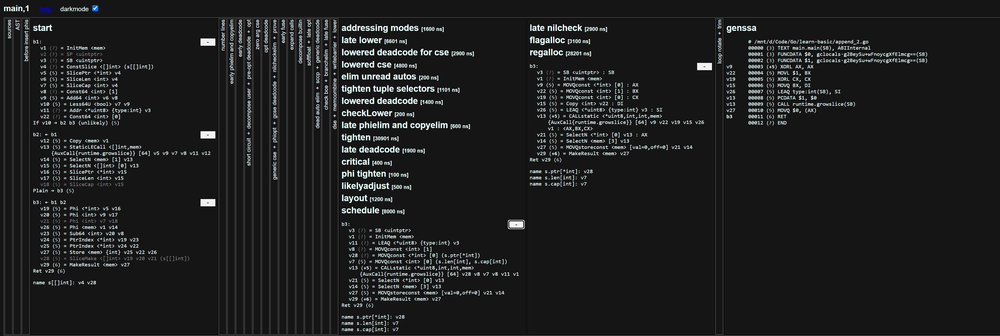

func append (s [] T, vs ...T) [] T 的增长原理

<!-- more -->

在学 Go 语言的过程中，了解到切片，同时学到了切片增长函数 append，在使用的过程中发现一些问题，所以研究源码记录一下。

## Why

在官方的 [A tour of Go](https://go.dev/tour/moretypes/15) 中，有这样一段代码

```go
package main

import "fmt"

func main () {
	var s [] int
	printSlice (s)

	//append works on nil slices.
	s = append (s, 0)
	printSlice (s)

	// The slice grows as needed.
	s = append (s, 1)
	printSlice (s)

	// We can add more than one element at a time.
	s = append (s, 2, 3, 4)
	printSlice (s)
}

func printSlice (s [] int) {
	fmt.Printf ("len=%d cap=%d %v\n", len (s), cap (s), s)
}

//result:
//len=0 cap=0 []
//len=1 cap=1 [0]
//len=2 cap=2 [0 1]
//len=5 cap=6 [0 1 2 3 4]
```

我发现一个规律：

len=5 cap=6
len=7 cap=8
len=9 cap=10
len=11 cap=12

在 0-5 容量内，len 和 cap 保持一致，在 len>5 对其进行扩容时，Go 似乎总是把 cap+2，然后我写了一段测试代码

```go
package main

import "fmt"

func main () {
	var nums [] int
	fmt.Printf ("初始状态:\n %v, len=%d, cap=%d\n", nums, len (nums), cap (nums))
	fmt.Println ("------------------------")

	for i := 1; i <= 1000; i++ {
		toAdd := make ([] int, 1)

		nums = append (nums, toAdd...)
		fmt.Printf ("追加 %d 个元素 %v 后:\n", i, toAdd)
		fmt.Printf ("len=%d, cap=%d\n", len (nums), cap (nums))
		fmt.Println ("------------------------")
	}
}

//result:
// 初始状态:
//  [], len=0, cap=0
//------------------------
// 追加 1 个元素 [0] 后:
//len=1, cap=1
//------------------------
// 追加 2 个元素 [0] 后:
//len=2, cap=2
//------------------------
// 追加 3 个元素 [0] 后:
//len=3, cap=4
//------------------------
//...
// 追加 5 个元素 [0] 后:
//len=5, cap=8
//------------------------
//...
// 追加 9 个元素 [0] 后:
//len=9, cap=16
//------------------------
//...
// 追加 17 个元素 [0] 后:
//len=17, cap=32
//......
//......
// ------------------------
// 追加512个元素[0]后:
// len=512, cap=512
// ------------------------
// 追加513个元素[0]后:
// len=513, cap=848
```

发现 512 cap 以内是按照 2 的指数来增长的，和上面代码的区别在于，这里是循环调用 append 增加 1 个元素，所以我非常好奇 append 的底层原理是怎么实现的？

## [append](https://pkg.go.dev/builtin#append)


官方文档解释很简洁，当切片 cap 不够时，分配一个新数组存储，然后返回

当我点击进去时只能看到 append 的函数声明



文件位于 go/src/builtin/builtin.go，这个文件只包含声明（declarations），不包含实现（implementations）。它的主要目的是：

- 为IDE提供类型信息
- 为开发者提供文档
- 为编译器提供类型检查信息

寻找源码的过程被迫中断了，去哪找呢？

我尝试问 AI 发现，类似 `make`, `new`, `append`... 这些函数属于 Go 的 `builtin` 函数，他们不需要导包就能使用，也没有具体的函数体实现，而是由编译器直接处理。

又回到了找源码的问题，编译过程怎么查看？

可以通过指定编译参数来查看编译步骤，比如指定 `GOSSAFUNC=main` 查看 main 函数。

接下来我对一段简单的 append 代码生成编译阶段：

```go
package main

func main() {
	var s []int
	s = append(s, 0)
}
```


通过上面步骤会在当前目录生成一个 `ssa.html` 文件。使用浏览器打开内容如下：



```text
v13 (5) = StaticLECall <[]int,mem> {AuxCall{runtime.growslice}} [64] v5 v9 v7 v8 v11 v12
```

重点看这行代码，append 实际上对应到了 `runtime.growslice`。


## growslice & nextslicecap

接下来到官方源码目录下找到 `runtime.growslice`，位于 `src/runtime/slice.go` 文件中，函数体如下：

```go
// growslice allocates new backing store for a slice.
//
// arguments:
//
//	oldPtr = pointer to the slice's backing array
//	newLen = new length (= oldLen + num)
//	oldCap = original slice's capacity.
//	   num = number of elements being added
//	    et = element type
//
// return values:
//
//	newPtr = pointer to the new backing store
//	newLen = same value as the argument
//	newCap = capacity of the new backing store
//
// ......
func growslice(oldPtr unsafe.Pointer, newLen, oldCap, num int, et *_type)
```

growslice 前面是一堆检查，后面是针对内存的优化处理，暂且略过，主要针对 `nextslicecap` 的代码进行研究

```go
func growslice(oldPtr unsafe.Pointer, newLen, oldCap, num int, et *_type)
	... // 检查
	newcap := nextslicecap(newLen, oldCap)
	... // 分配内存

func nextslicecap(newLen, oldCap int) int {
	newcap := oldCap
	doublecap := newcap + newcap
	if newLen > doublecap {
		return newLen
	}

	const threshold = 256
	if oldCap < threshold {
		return doublecap
	}
	for {
		// Transition from growing 2x for small slices
		// to growing 1.25x for large slices. This formula
		// gives a smooth-ish transition between the two.
		newcap += (newcap + 3*threshold) >> 2

		// We need to check `newcap >= newLen` and whether `newcap` overflowed.
		// newLen is guaranteed to be larger than zero, hence
		// when newcap overflows then `uint(newcap) > uint(newLen)`.
		// This allows to check for both with the same comparison.
		if uint(newcap) >= uint(newLen) {
			break
		}
	}

	// Set newcap to the requested cap when
	// the newcap calculation overflowed.
	if newcap <= 0 {
		return newLen
	}
	return newcap
}
```

解释：

- 当 newLen(oldCap+num) > doublecap，直接返回 newLen
- 否则，当 oldCap < 256 时，返回 doublecap，也就是两倍的 oldCap
- 当 oldCap 超过 256 时，增长倍数从 2x -> 1.25x
- 最后是做溢出检查

参考上面的代码，每次扩容的数量应该是：

- 一次性添加多个：1 2 3 4 5 6 7 8 9 10...
- 循环添加一个：1 2 4 8 16 32 64 128 256 512 832...

但是实际上却是：

- 一次性添加多个：1 2 3 4 6 8 10...
- 循环添加一个：1 2 4 8 16 32 64 128 256 512 848...

why？

## roundupsize

从 nextslicecap 接着往下走，发现一个函数 `roundupsize`，如下所示

```go
func growslice(oldPtr unsafe.Pointer, newLen, oldCap, num int, et *_type) slice {
	...
	case et.Size_ == goarch.PtrSize:
		lenmem = uintptr(oldLen) * goarch.PtrSize
		newlenmem = uintptr(newLen) * goarch.PtrSize
		capmem = roundupsize(uintptr(newcap)*goarch.PtrSize, noscan)
		overflow = uintptr(newcap) > maxAlloc/goarch.PtrSize
		newcap = int(capmem / goarch.PtrSize)
	case isPowerOfTwo(et.Size_):
		var shift uintptr
		if goarch.PtrSize == 8 {
			// Mask shift for better code generation.
			shift = uintptr(sys.TrailingZeros64(uint64(et.Size_))) & 63
		} else {
			shift = uintptr(sys.TrailingZeros32(uint32(et.Size_))) & 31
		}
		lenmem = uintptr(oldLen) << shift
		newlenmem = uintptr(newLen) << shift
		capmem = roundupsize(uintptr(newcap)<<shift, noscan)
		overflow = uintptr(newcap) > (maxAlloc >> shift)
		newcap = int(capmem >> shift)
		capmem = uintptr(newcap) << shift
	...
}

func roundupsize(size uintptr, noscan bool) (reqSize uintptr) {
	reqSize = size
	if reqSize <= maxSmallSize-mallocHeaderSize {
		// Small object.
		if !noscan && reqSize > minSizeForMallocHeader { // !noscan && !heapBitsInSpan(reqSize)
			reqSize += mallocHeaderSize
		}
		// (reqSize - size) is either mallocHeaderSize or 0. We need to subtract mallocHeaderSize
		// from the result if we have one, since mallocgc will add it back in.
		if reqSize <= smallSizeMax-8 {
			return uintptr(class_to_size[size_to_class8[divRoundUp(reqSize, smallSizeDiv)]]) - (reqSize - size)
		}
		return uintptr(class_to_size[size_to_class128[divRoundUp(reqSize-smallSizeMax, largeSizeDiv)]]) - (reqSize - size)
	}
	// Large object. Align reqSize up to the next page. Check for overflow.
	reqSize += pageSize - 1
	if reqSize < size {
		return size
	}
	return reqSize &^ (pageSize - 1)
}
```

growslice 里面通过 roundupsize 重新优化算出 newcap 所占字节数，再重新将字节数转成 newcap 的大小
重点就是下面这串代码，能够把 5->6 832->848，为什么这么做呢？

```go
class_to_size[size_to_class8[divRoundUp(reqSize, smallSizeDiv)]]
```

这样做的原因主要有下面几点：

a) 内存规整：
```go
// 不规整的分配
make([]byte, 5)  -> 5字节
make([]byte, 7)  -> 7字节
// 会导致大量不同大小的内存块，难以复用

// 规整后的分配
make([]byte, 5)  -> 8字节
make([]byte, 7)  -> 8字节
// 相同大小便于复用
```

b) 内存复用：
```go
// 示例场景
s1 := make([]byte, 5)  // 分配8字节
s2 := make([]byte, 7)  // 分配8字节
// s1 释放后的内存可直接给 s2 使用
```

c) 缓存友好：
```go
// 固定大小的内存块有利于内存缓存
// 例如：所有8字节的块可以放在一起管理
span1 := []*8bytes    // 8字节的块池
span2 := []*16bytes   // 16字节的块池
```

## 小结

本次折腾结束，Go 对内存做了很多处理，能够让我们不手动管理内存也能得到极高的效率，这点确实要比 C 好很多。


疑问：
goarch.PtrSize 代表什么意思？
